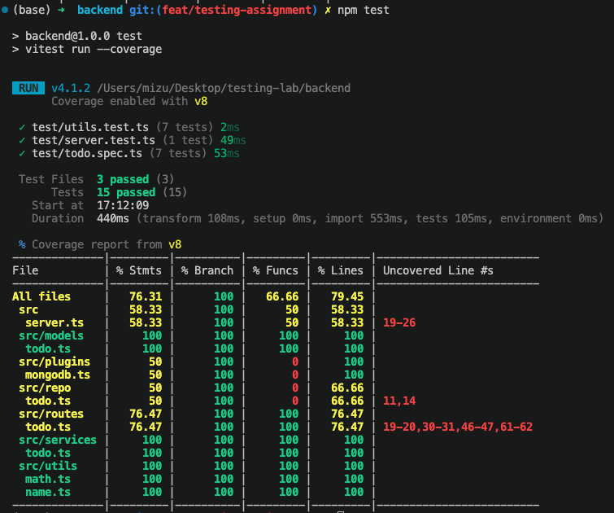
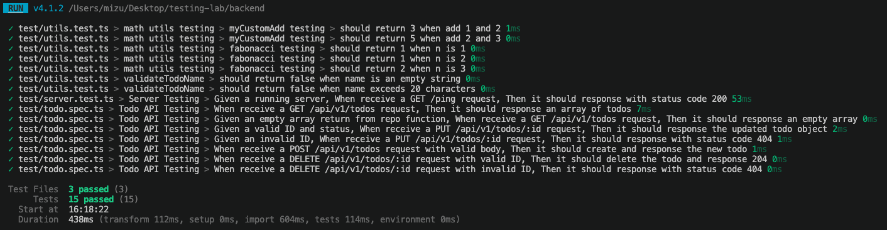
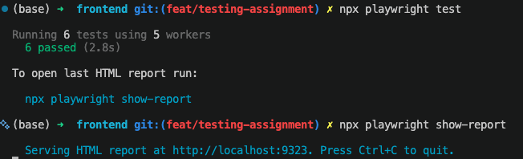
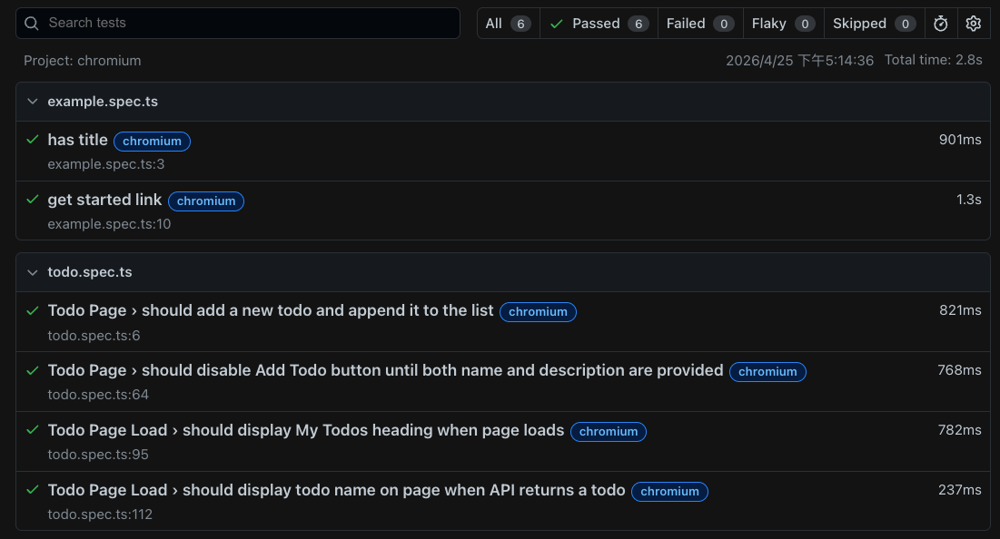
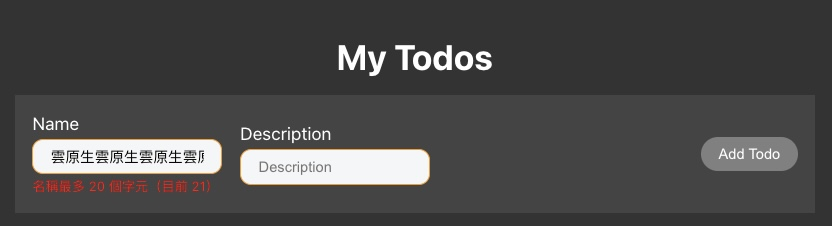
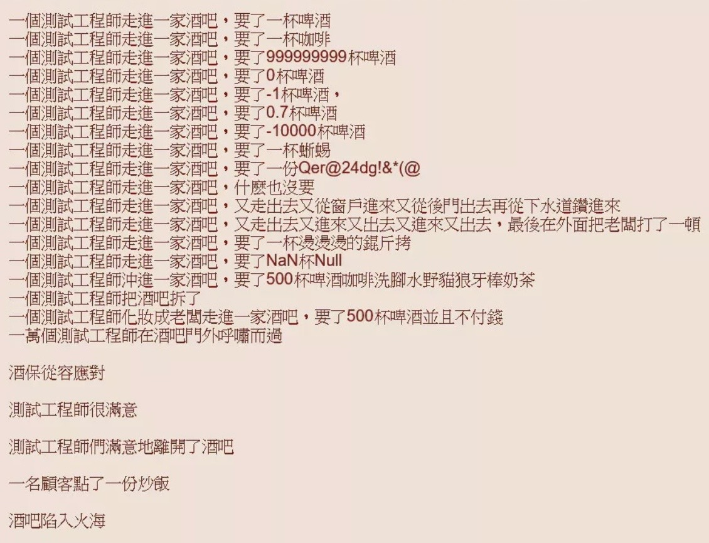

# Testing Lab

## 一、測試案例一：後端 Unit Test — `validateTodoName`

### 1. 程式碼片段

**`backend/src/utils/name.ts`**

```ts
export function validateTodoName(name: string): boolean {
  const trimmed = name.trim()
  return trimmed.length > 0 && trimmed.length <= 20
}
```

**`backend/test/utils.test.ts`（新增部分）**

```ts
import { validateTodoName } from '../src/utils/name'

describe('validateTodoName', () => {
  it('should return false when name is an empty string', () => {
    // Arrange
    const name = ''

    // Act
    const result = validateTodoName(name)

    // Assert
    expect(result).toBe(false)
  })

  it('should return false when name exceeds 20 characters', () => {
    // Arrange
    const name = 'a'.repeat(21)

    // Act
    const result = validateTodoName(name)

    // Assert
    expect(result).toBe(false)
  })
})
```

### 2. 測試報告





### 3. 說明

**測試工具：Vitest**

Vitest 是 Node.js 環境下的單元測試框架，與 Vite 生態系整合，執行速度快，適合用於純函式的邏輯驗證。

**測試策略：邊界值測試（Boundary Value Testing）**

- **測試主體**：`backend/src/utils/name.ts` 中的 `validateTodoName(name: string): boolean`，此函式驗證 Todo 名稱是否合法，名稱不得為空白字串，且長度不得超過 20 個字元。
- **測試場景**：針對函式在極端輸入下的行為進行驗證，邊界值是最容易出錯的地方。
  1. 最小邊界：空字串（長度 0）
  2. 超出上界：長度 21（超過最大允許長度 20）
- **預期結果**：兩個 test cases 皆應回傳 `false`。
- **想驗證的東西**：函式能正確拒絕空字串與過長的名稱，確保資料在進入資料庫前的合法性。

遵循 **AAA 原則（Arrange / Act / Assert）**，每個 test case 只驗證一件事。

如第二張截圖（verbose 模式）所示，`test/utils.test.ts > validateTodoName` 底下的兩條測試皆顯示綠色打勾：
- `should return false when name is an empty string`
- `should return false when name exceeds 20 characters`

---

## 二、測試案例二：前端 E2E Test — Todo 頁面載入驗證

### 1. 程式碼片段

**`frontend/tests/todo.spec.ts`（新增部分）**

```ts
test.describe('Todo Page Load', () => {
  const BASE_URL = 'http://localhost:5173';

  test('should display My Todos heading when page loads', async ({ page }) => {
    // Arrange
    await page.route('**/api/v1/todos', route =>
      route.fulfill({
        status: 200,
        contentType: 'application/json',
        body: JSON.stringify({ todos: [] })
      })
    );

    // Act
    await page.goto(BASE_URL);

    // Assert
    await expect(page.getByRole('heading', { name: 'My Todos' })).toBeVisible();
  });

  test('should display todo name on page when API returns a todo', async ({ page }) => {
    // Arrange
    await page.route('**/api/v1/todos', route =>
      route.fulfill({
        status: 200,
        contentType: 'application/json',
        body: JSON.stringify({
          todos: [{ id: '1', name: 'Buy groceries', description: 'milk and eggs', status: false }]
        })
      })
    );

    // Act
    await page.goto(BASE_URL);

    // Assert
    await expect(page.getByRole('heading', { name: 'Buy groceries' })).toBeVisible();
  });
});
```

### 2. 測試報告





### 3. 說明

**測試工具：Playwright**

Playwright 是由 Microsoft 開發的 End-to-End 測試框架，可模擬真實瀏覽器行為（Chromium / Firefox / WebKit），並支援 `page.route()` 攔截 API 請求，讓測試不依賴真實後端。

**測試策略：頁面渲染驗證（Rendering Verification）**

- **測試主體**：`frontend/tests/todo.spec.ts` — Todo 頁面（`http://localhost:5173`）的初始載入行為。
- **測試場景**：頁面**首次載入**時，透過 `page.route()` mock API 回應，只驗證前端 UI 的顯示邏輯。
  1. 頁面是否正確顯示標題 `My Todos`
  2. 當 API 回傳一筆 Todo 時，該 Todo 的名稱是否出現在畫面上
- **預期結果**：標題與 Todo 名稱皆應在畫面上可見（`toBeVisible()`）。
- **想驗證的東西**：前端元件能正確接收並渲染 API 資料，確保 UI 顯示邏輯的正確性，屬於 Test Pyramid 最上層的 UI 測試。

遵循 **AAA 原則（Arrange / Act / Assert）**，mock API 為 Arrange，`page.goto()` 為 Act，`expect` 為 Assert。

---

## 三、補充內容

### 兩種測試的對比

| | 後端 Unit Test | 前端 E2E Test |
|---|---|---|
| 工具 | Vitest | Playwright |
| 測試層 | 工具函式（Test Pyramid 底層） | UI 渲染（Test Pyramid 頂層） |
| 執行速度 | 快（< 500ms） | 慢（需啟動瀏覽器，約 2s） |
| 依賴 | 無外部依賴 | 需要 dev server 運行 |
| Mock | 不需要 | `page.route()` mock API 回應 |
| 驗證重點 | 函式邏輯的正確性 | UI 元件的渲染行為 |

Unit Test 快速且穩定，適合頻繁執行；E2E Test 貼近真實使用者情境，但成本較高。兩者互補，共同保障產品品質。

### 延伸實作：前端即時名稱驗證

在完成測試後，將 `validateTodoName` 的驗證邏輯延伸至前端，讓使用者在輸入時即時看到錯誤提示。

**`frontend/src/components/AddTodo.tsx`（修改部分）**

```tsx
const MAX_NAME_LENGTH = 20

const nameTooLong = formData.name.length > MAX_NAME_LENGTH

useEffect(() => {
  setIsDisabled(formData.name === '' || formData.description === '' || nameTooLong)
}, [formData])

{nameTooLong && (
  <span style={{ color: 'red', fontSize: '0.75rem' }}>
    名稱最多 {MAX_NAME_LENGTH} 個字元（目前 {formData.name.length}）
  </span>
)}
```

當使用者輸入超過 20 個字元時，畫面即時顯示錯誤提示，Add Todo 按鈕同步 disable，與後端 `validateTodoName` 的驗證邏輯保持一致。



### Ｍeme


